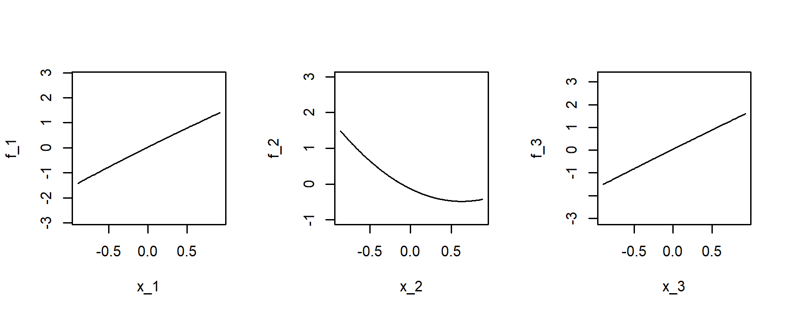

# CSurf: Change Surface (CSurf) regression method for nonlinear subgroup identification

We introduce a novel change surface regression model that offers a potential model-based framework for multiple nonlinear subgroups identification in complex datasets. The underlying grouping variable is a nonlinear function of relevant covariates and naturally forms a hypersurface residing in the high-dimensional covariate space. When the numerical value of the surface crosses certain cutoffs, the model regression coefficients may rise or drop to different values and that allows us to divide the population into subgroups according to heterogeneous regression dependencies. 
We contribute an iterative two-stage estimation approach that combines the change point detection technique in the first stage and the smoothed local adaptive majorize-minimization algorithm for manifold learning in the second stage. Our computational method is completely data-driven and specifically designed to address the challenges posed by high-dimensional data with complicated subgroup structures, where traditional subgroup detection techniques might fail. By exploiting double penalization and local majorization optimization, our computing method can effectively perform variable selection and identify the hidden subgroup patterns. 

## Installation
You can install CSurf from GitHub using devtools. It should install in 1 minute, but may take longer if you need to update dependencies.  

``` r
library(devtools)
devtools::install_github("chrystal23/CSurf")
```

## Tutorial

The main function CSurf requires the following inputs:

### Inputs

- `y`: A vector (length n) of the response for subgroup identification.
- `X`: A matrix (n x p) of the covariates for subgroup identification. The covariates are also used as potential thresholding variables for subgroup identification.
- `f_hat0`: A vector (length n) of the initialization for the threshold function (change surface).
- `Tighten`: A boolean indicating whether to include the tightening stage in optimization.
- `tol_out`: The tolerance value for optimization (stopping criterion).
- `maxiter_out`: The maximal number of iterations allowed for optimization.
- `m`: An integer indicating the power of the threshold function.
- `lam2rate`: The ratio between the two tunning parameters, lambda1 and lambda2.

The CSurf function returns a list of estimation results: 

 ### Outputs

- `f_all.hat`: The estimated threshold functions. Each column represent one component function.
- `tau.hat`: The estimated change points over the threshold functions.
- `alp.hat`: The estimated regression coefficients.
- `X_ord`: the re-ordered covariate matrix, which corresponds to above estimation results
- `y_ord`: the re-ordered response vector, which corresponds to above estimation results
- `coverged_out`: An boolean indicating whether the algorithm successfully converged.
- `iter_out`: The number of iterations it took to converge.
- `...`: Other estimation results.

An example input data is can be loaded using
```r
data(syn_data)
```
where an example response vector (length 500) `y`, a covariate matrix (500 x 30) `X`, and a vector of threshold function initialization (length 500) `f_hat0` are included. To implement our CSurf method on this example data to identify subgroups, we run
```r
results <- CSurf(y = y, X = X, f_hat0 = f_hat0, h = .5, maxiter_out = 10, tol_out = 0.0001)
```
where `h = .5, maxiter_out = 10, tol_out = 0.0001` is exactly the default setting but can be specified by users based on their requirement for the optimization.
The estimation results are
```r
f_all.hat = results$f_all.hat
alp.hat<- results$alp.hat
tau.hat<- results$tau.hat
Xord = results$Xord
```
The component of threshold functions that characterize the subgroups can be visualized:
```r
par(mfrow = c(1,3))
for (j in 1:3) {
   plot(y = f_all.hat[order(Xord[,j]),j], 
        x = sort(Xord[,j]), 
        ylim = range(f_all.hat[,j])*2,
        type = "l", 
        xlab = paste("f", j, sep =  "_"), 
        ylab = paste("f", j, sep =  "_")) 
 }
```


We can obtain the subgroup membership, denoted by `subgr.hat`, of each observation (subject) from the results
```r
subgr.hat <- rep(1,dim(Xord)[1])
for (k in 1:length(tau.hat)) {
  id <- which( rowSums(f_all.hat) > tau.hat[k] )
  subgr.hat[id] <- subgr.hat[id] + 1
}
table(subgr.hat)
```
| subgr.hat | 1 | 2 | 3 |
|---|-------------|----------|-------------------------|
|  | 116 | 196 | 188 |

This means that CSurf divided the data into 3 subgroups of sizes 116, 196, and 188, respectively. Various downstream analyses can then be performed on each subgroup.

